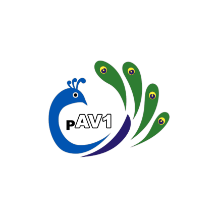

## pAVONE

Player-AV1, a multimedia player crafted specifically for Android devices. 

Developed using Kotlin and powered by ExoPlayer, it empowers users to seamlessly play multimedia content stored on their devices or accessible through adaptive streaming MPEG-DASH. Featuring the GAV1 decoder implementation, it excels in supporting AV1 video format. 

The application's source code is available for exploration, providing transparency and opportunities for collaboration.

